<!-- Banner -->

  

<h1 align="center">Hi, I'm Kabilan K</h1>

  <b>Full Stack Developer | AI Systems Builder</b>

  

  

---

## About Me

<table>
  <tr>
    <td width="60%" valign="middle">
      Aspiring Software Development Engineer with experience in full stack development and AI-powered applications.
        
      I build scalable, customer-focused software, from React frontends and FastAPI backends to RAG pipelines and LLM orchestration.
        
      B.Tech CSE (AI) at <b>Amrita Vishwa Vidyapeetham</b>
    </td>
    <td width="40%" align="center">
      <!-- 
      -->
      
    </td>
  </tr>
</table>

---

## Stack & Tools

  

<h3 align="center">Focus Areas</h3>

  
  
  
  
  
  

---

